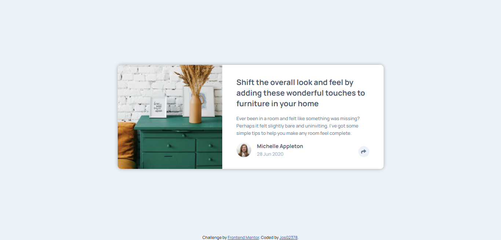

# Frontend Mentor - Article preview component solution

This is a solution to the [Article preview component challenge on Frontend Mentor](https://www.frontendmentor.io/challenges/article-preview-component-dYBN_pYFT). Frontend Mentor challenges help you improve your coding skills by building realistic projects.

## Table of contents

- [Overview](#overview)
  - [The challenge](#the-challenge)
  - [Screenshot](#screenshot)
  - [Links](#links)
- [My process](#my-process)
  - [Built with](#built-with)
  - [What I learned](#what-i-learned)
  - [Useful resources](#useful-resources)
- [Author](#author)

## Overview

### The challenge

Users should be able to:

- View the optimal layout for the component depending on their device's screen size
- See the social media share links when they click the share icon

### Screenshot



### Links

- Solution URL: (https://www.frontendmentor.io/solutions/responsive-article-preview-using-html-css-and-javascript-tWPO8k65F)
- Live Site URL: (https://article-preview-component-master-jos02378.netlify.app/)

## My process

### Built with

- Semantic HTML5 markup
- CSS custom properties
- Flexbox
- CSS Grid
- Mobile-first workflow

### What I learned

From this challenge, I learned how to position an absolute element horizontally, also using the unit `em` for padding.

```css
.profile--active::before {
  content: '';
  position: absolute;
  left: 0;
  right: 0;
  margin: auto;
}
```

### Useful resources

- [resource 1](https://css-tricks.com/forums/topic/horizontal-centering-of-an-absolute-element/) - This helped me to center an absolute element horizontally.

## Author

- Jos02378 (https://github.com/Jos02378)
